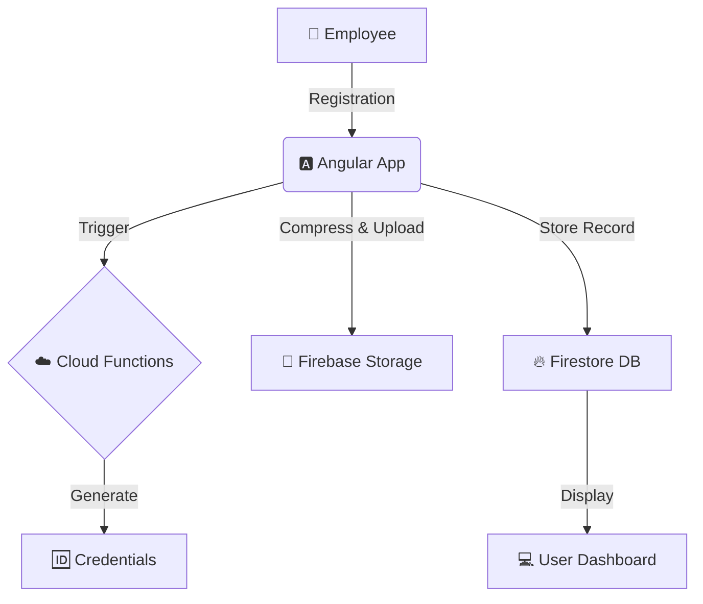

# 📊 **BITA-EmployeeDB**
## A Modern Employee Management Solution for BITA
**BITA-EmployeeDB** is a streamlined Employee Management System developed for the
internal staff registration and data management of the Bangladesh Institute of
Theatre Arts (BITA). Built with a focus on scalability and security, it leverages
Angular for a dynamic frontend and Firebase for robust backend services.

## 🚀 **Key Features**
🔑 **Automated Credentials:** Uses Firebase Cloud Functions to automatically generate
unique User IDs and Passwords for every employee upon registration.
🖼️ **Smart Image Upload:** Integrated browser-image-compression to compress profile photos below 200KB before upload, ensuring storage efficiency.
✅ **Data Integrity:** Implemented standardized dropdown menus (e.g., Religion: Hinduism/Islam, Blood Group) to ensure high-quality, consistent data entry.
🔒 **Secure Session Management:** Cookie-based authentication that persists user data and displays the employee's profile picture directly in the navigation bar.
🌐 **CORS Optimized:** Configured Google Cloud Storage CORS policies to allow
seamless, secure cross-origin image uploads from the web application.

## 🛠 **Tech Stack**

| Category | Technology |
| :--- | :--- |
| **Frontend** | Angular 19 (Material UI, Bootstrap) |
| **Backend** | Firebase (Cloud Functions, Firestore DB) |
| **Storage** | Firebase Cloud Storage |
| **Version Control** | Git & GitHub |
| **Methodology** | Data Engineering Principles (IBM Professional Certificate) |

## 🏗 **System Architecture**


    
## ⚙️ **Setup and Installation**

1. Clone the repository:
 ```git clone https://github.com/santunu23/bita_employee_management.git```
2. Install dependencies:
 ```npm install```
3. Firebase Configuration: Add your Firebase API Keys and Project ID into the ```src/environments/environment.ts``` file.
4. Run Development Server: ```ng serve```
Navigate to ```http://localhost:4200/ ```in your browser.

## 📈 **Project Status**

The application is currently in the User Acceptance Testing (UAT) phase. Feedback
is being gathered from BITA colleagues to continuously refine the user experience
and add new features.

## 👨‍💻 **Developed By**
**Joy Sen** ,IT Expert & Business Development Officer, Bangladesh Institute of Theatre Arts (BITA)
